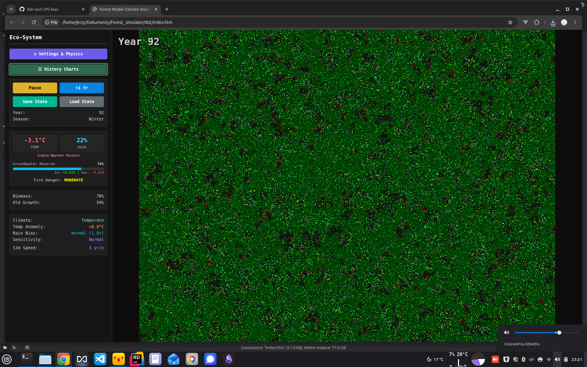
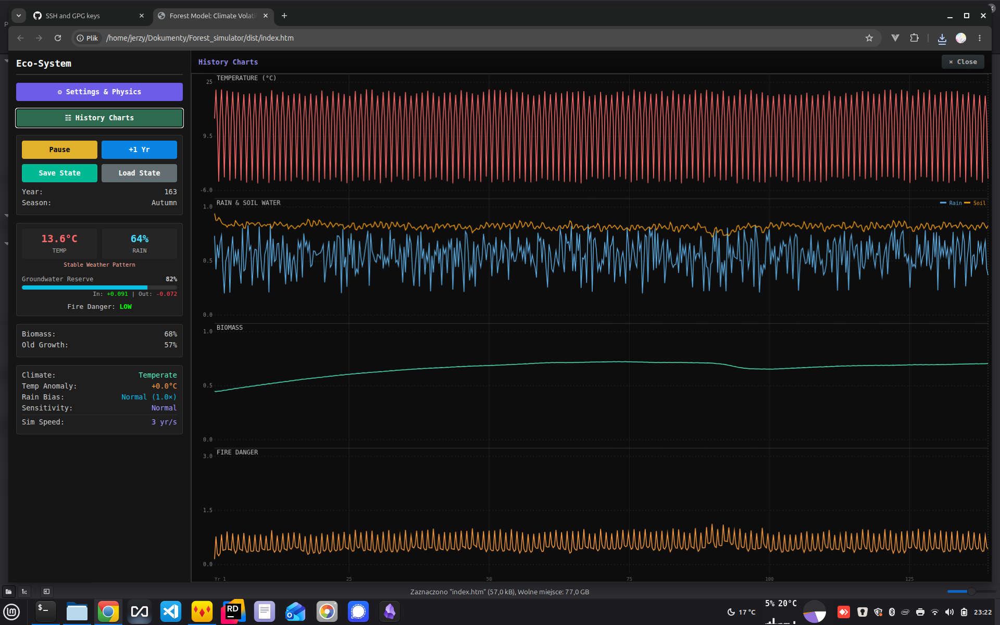

# Forest Fire Simulator

A browser-based cellular automaton that models a living forest — trees grow, burn, recover, and collapse under the pressure of climate change.





---

## Quick Start

### For end users — single file, no server needed

Build the self-contained bundle once:

```bash
python3 build.py
```

Then open **`dist/index.htm`** directly in any modern browser (Chrome, Firefox, Edge). Double-click to run — no server, no install, nothing else required.

### For developers

The source files use ES modules, which browsers block on `file://`. Serve the project root over HTTP:

```bash
python3 -m http.server 8080
```

Then open `http://localhost:8080/` to run the simulation and `http://localhost:8080/test/` for the test suite.

---

## What You're Looking At

The main canvas shows an 800 × 600 grid of cells, each one a patch of ground:

| Colour | Meaning |
|--------|---------|
| Dark brown / bare | Empty ground — no trees |
| Light green | Sapling (age 0–5) — high fire risk |
| Mid green | Young tree (age 6–10) |
| Deep green | Mature tree (age 11–25) — low fire risk |
| Olive / dark | Old growth (age 25+) — very resistant to fire |
| Orange / red | Fire — burns for one tick then leaves bare ground |

The right panel shows live readings: year, season, temperature, rainfall, groundwater reserve, fire danger, biomass, and old-growth fraction.

---

## Controls

### Toolbar buttons
| Button | What it does |
|--------|-------------|
| **⚙ Settings & Physics** | Opens the configuration drawer (see below) |
| **🗠 History Charts** | Overlays a full-screen chart of the entire run history |
| **Pause / Resume** | Freeze and unfreeze the simulation |
| **+1 Yr** | Step forward exactly one year (four seasons) while paused |
| **Save State** | Download a compressed `.fsc` checkpoint of the current simulation |
| **Load State** | Restore a previously saved `.fsc` file |
| **Reset World** | Wipe the grid and restart from Year 1 |

### Settings drawer

Open with **⚙ Settings & Physics**.

**Climate Type** — the regional archetype. Changing this resets the simulation.

| Preset | Character |
|--------|-----------|
| Temperate | Mild four seasons; rainfall distributed year-round |
| Mediterranean | Hot dry summer; mild wet winter; fire-prone |
| Tropical (Wet/Dry) | No cold season; alternating drenching wet and searing dry |
| Boreal | Short warm summer; long harsh winter; slow growth |
| Semi-Arid | Chronically low rain; sparse cover; frequent fires |

**Atmosphere**
- **Temperature Anomaly** — extra °C above the climate baseline. At +5 °C evaporation accelerates; at +8–10 °C catastrophic dieback becomes common.
- **Rainfall Bias** — multiplier on all precipitation. Below 1.0 = drought; above 1.0 = flooding risk.

**Ecosystem Physics**
- **Model Sensitivity** — how strongly the ecosystem reacts to stress. *Optimistic* absorbs more punishment; *Pessimistic* collapses faster.
- **Basal Metabolism** — the fixed water cost every plant pays each tick just to survive.
- **Growth Rate** — how quickly trees colonise empty soil.

**Disaster**
- **Fire Frequency** — scales the rate of random lightning ignitions.

**System**
- **Simulation Speed** — seasons per second (4 seasons = 1 year). The render rate is always at display refresh speed and is not affected.

---

## History Charts

Click **🗠 History Charts** any time to see the full run plotted across four bands:

1. **Temperature** — current temp vs baseline
2. **Rain & Soil Water** — precipitation and groundwater reserve on the same axis
3. **Biomass** — tree cover fraction over time
4. **Fire Danger** — the composite fire risk index

Each band shows **event markers** (fire events, drought events) as labelled flags, **proportional gridlines** scaled to the data range, and a **"now" cursor** tracking the current simulation tick. Close with **×** to return to the live simulation.

---

## How the Model Works

The simulation runs on a two-layer grid:

- **State grid** — each cell is *empty*, *tree*, or *on fire*.
- **Age grid** — trees age each tick; age controls flammability and waterlogging vulnerability.

Each tick is one season (¼ year). The engine updates in this order:

1. **Climate** — current temperature and rainfall are computed from the active preset's seasonal modifiers plus random noise. Volatility increases with temperature anomaly.
2. **Water balance** — rainfall infiltrates (reduced on saturated soil), transpiration drains water proportional to forest density, evaporation scales with heat. The net drives `soilWater` up or down.
3. **Fire danger** — a composite of heat stress and soil stress; suppressed when soil is flooded.
4. **Cell update** — each cell either grows, dies (drought or waterlogging), catches fire from a neighbour, or is struck by lightning.

### Tree flammability by age stage

| Stage | Age | Flammability |
|-------|-----|-------------|
| Sapling | 0–5 | 0.80 (very high) |
| Young | 6–10 | 0.40 |
| Mature | 11–25 | 0.20 |
| Old growth | 25+ | 0.05 (very low) |

### Water balance highlights

- **Horton runoff** — rain absorption falls on saturated soil; you won't flood indefinitely.
- **Transpiration feedback** — a dense canopy draws water faster than bare ground, creating a self-regulating loop.
- **Waterlogging** — sustained saturation above 92% starts killing trees from root asphyxiation, especially old growth.
- **Flood signal** — overflow beyond soil capacity suppresses fire danger and amplifies waterlogging mortality.

---

## Interesting Experiments

**Can the forest survive a 10 °C warming?**
Set Temperature Anomaly to max, watch groundwater collapse, then observe whether any old-growth patches hold on.

**Boreal vs Mediterranean fire regimes**
Switch between the two presets at default settings. Mediterranean cycles through dramatic summer fire events; Boreal barely burns but grows very slowly.

**Tipping point**
Start Temperate at defaults. Run for 50 years. Then crank Temperature Anomaly to +6 and Rainfall Bias to 0.3 simultaneously — watch how fast the ecosystem crosses the threshold.

**Dense forest under drought**
Let the forest mature for 60 years (dense canopy). Apply moderate drought. The transpiration feedback accelerates soil depletion compared to a sparse forest in the same drought.

---

## Running the Test Suite

The test suite validates internal model behaviour and is intended for developers or curious explorers.

**Requirement:** You need a local HTTP server because the tests use ES modules (which browsers block on `file://`).

```bash
# From the project directory:
python3 -m http.server 8080
```

Then open in your browser:

| URL | Suite | Scenarios |
|-----|-------|-----------|
| `http://localhost:8080/test/` | Hub — links to all suites | — |
| `http://localhost:8080/test/water/` | Water model | WM-1 to WM-5 (15 checks) |
| `http://localhost:8080/test/fire/` | Fire mechanics | FM-1 to FM-5 (13 checks) |
| `http://localhost:8080/test/seasons/` | Seasonal logic | SL-1 to SL-6 (42 checks) |
| `http://localhost:8080/test/sensitivity/` | Sensitivity parameter | SS-1 to SS-4 (12 checks) |

Each page runs all scenarios automatically and shows PASS / FAIL per check. A **Download JSON** button at the bottom lets you save a timestamped result file.

Committed result files live in `test_results/`.

---

## File Layout

```
build.py               ← run once to produce dist/index.htm (end-user bundle)
dist/index.htm         ← generated; double-click to run, not in git
index.htm              ← dev entry point (requires HTTP server)
simulation.js          ← WebGL renderer + UI wiring + save/load
simulation-engine.js   ← pure simulation logic (no DOM)
issues.js              ← registry of all known model issues (W, S, F series)
test_framework.js      ← shared test runner (imported by test pages)
test/
  index.htm            ← test hub page
  water/index.htm      ← water model test runner
  fire/index.htm       ← fire mechanics test runner
  seasons/index.htm    ← seasonal logic test runner
  sensitivity/index.htm ← sensitivity parameter test runner
tests/
  water_model.js       ← water model scenarios
  seasonal_logic.js    ← seasonal logic scenarios
  fire_mechanics.js    ← fire mechanics scenarios
  sensitivity.js       ← sensitivity parameter scenarios
test_results/
  water_model/         ← committed JSON results
  seasonal_logic/      ← committed JSON results
  fire_mechanics/      ← committed JSON results
  sensitivity/         ← committed JSON results
model_water.md         ← water subsystem design & issue log
model_seasonal_logic.md ← seasonal/climate design & issue log
model_fire.md          ← fire subsystem design & issue log
test_water_model.md    ← early water model test spec (pre-framework)
PROGRESS.md            ← session-by-session development log
```

---

## Save / Load

Click **Save State** to download a `.fsc` checkpoint file. The filename encodes what's inside:

```
forest-yr347-2026-04-26-122d7e0.fsc
         ^^^  ^^^^^^^^^^  ^^^^^^^
         year  save date  git commit hash of the engine that produced it
```

The commit hash lets you run `git show 122d7e0` to see exactly which engine version created the file. Click **Load State** and pick a `.fsc` file to restore the full simulation — grids, history charts, and all parameters.

Files are gzip-compressed JSON; typical size 150–350 KB.

---

## Project Status

| Subsystem | Status |
|-----------|--------|
| Water balance (W1–W5) | Validated — 5 fixes applied, 15/15 tests pass |
| Seasonal logic (S1–S6) | Validated — 6 fixes applied, 42/42 tests pass |
| Fire mechanics (F1–F5) | Validated — F1/F2/F3 fixed; F4/F5 accepted; 13/13 tests pass |
| Sensitivity parameter (SS-1–SS-4) | Validated — 12/12 tests pass; Pessimistic collapses at ta=4 (documented) |
| Save / Load | Live — gzip `.fsc` format, git-traceable engine version in filename |
| Distribution bundle | Live — `python3 build.py` produces `dist/index.htm`, no server needed |
| `hasBurningNeighbor()` boundary bug (F1) | Fixed |
| environmentalFlam hard cap (F2) | Fixed — smooth ramp capped at 0.80; old-growth max totalFlam = 0.85 |
| pLightning step function (F3) | Fixed — continuous exponential, 1000× range fdi 0→3 |
| Water balance calibration (Temperate) | Partial — coeff raised 0.012→0.060; equilibrium ~85% vs 50–70% target; deeper fix pending |

The simulator is functional and visually interesting at all settings. The validation work focuses on whether the *numbers* match the *intended ecology*, not on whether it looks good.
